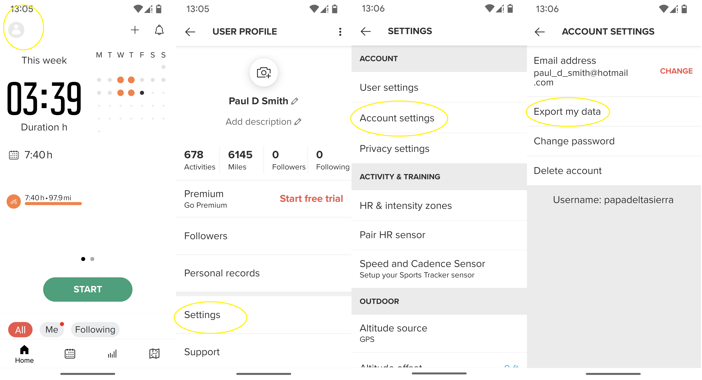

# STGPX - Sports-Tracker GPX Downloader

## Export from The App!
I chanced upon how to download the same data from your Android (and presumably IoS) app instead of having to use this tool.  The image below shows the four screenshots from the startnig app screen and the places for you to click.  Enjoy!


---
A tool for exporting and downloading GPX files for all activities from the [Sports Tracker] website.

> The author is unrelated to [Sports Tracker] in any way and takes no resposibiilty for any loss of activity data or access to your [Sports Tracker] account as a result of using this tool.

## Overview
This tool does the following:
- Using the browser of your choice, driving by the [Selenium] test tool...
- Logs into your [Sports Tracker] account
- Lists **ALL** activities
- Exports each activity as a GPX file to a directory of your chioce or your browser's default download directory
- If you specified a custom download directory, optionally cleans duplicate files.

## Status
**Prototype**

The code runs and has successfully downloaded over 600 activity GPX files form the [Sports Tracker] website.

### Issues
1. The log-in process sometimes fails.  The script makes 5 attempts to login and will give-up after that.  Waiting a while and retrying the script normally works.
1. After a number of attempts, log-in consistently fails.  I suspect this is [Sports Tracker] getting shirty but retrying after about 15 minutes seems to solve this.

### Tested Against

**Untested unless a browser version is shown**

|Browser|Version|Platform|
|-|-|-|
|Chrome|136.0.7103.114|Window 10|
|Edge|136.0.3240.76|Window 10|
|Firefox|**Untested**|Window 10|
|Safari|**Untested**|Apple OS|

## Installation
This tools is not yet packaged.  You can download the code from this site, install the Selenium package, and use it.

> A `poetry.toml` file is provided so that you can use [poetry] to run the tool if you prefer.

## Usage
```bash
$ stgpx --help
usage: stgpx.py [-h] [-v] [-d] [-l LOGFILE] -m {list,download} [-u USERNAME] [-p PASSWORD]
                [--chrome | --edge | --firefox | --safari] [-o OUTPUT] [-c]

STGPX - Spots-Tracker Downloader

options:
  -h, --help            show this help message and exit
  -v, --verbose         Increase verbosity (up to 3 times)
  -d, --debug           Increase debugging (up to 3 times)
  -l LOGFILE, --logfile LOGFILE
                        Debug logfile name
  -m {list,download}, --mode {list,download}
                        Operation mode
  --chrome              Use Chrome WebDriver
  --edge                Use Edge WebDriver
  --firefox             Use Filefox WebDriver
  --safari              Use Safari WebDriver

login:
  Login to Sports-Tracker

  -u USERNAME, --username USERNAME
                        Username for Sports-Tracker
  -p PASSWORD, --password PASSWORD
                        Password for Sports-Tracker

output:
  Output options

  -o OUTPUT, --output OUTPUT
                        Downloaded files output directory
  -c, --clean           Clean duplicated files from output directory after downloading
```

e.g.
```bash
$ stgpx --username <your-username> --password <your-password> --chrome --mode download --output ~/gpx --clean --verbose
```

> Note that downloading a lot of activities will take a long time.  You will see a new `.` appear each time an activity is downloaded.

[Sports Tracker]: https://sports-tracker.com/
[Selenium]: https://www.selenium.dev/
[poetry]: https://python-poetry.org/